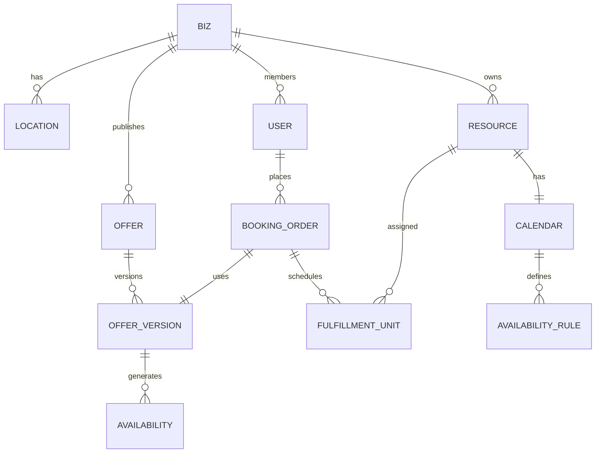

# SCHEMA_BIBLE.md — The Complete Bizing Database Schema

> **The canonical reference for understanding Bizing's data architecture.**

**Version:** 2026.02.28  
**Total Schema Files:** 85 modules  
**Core Tables:** 150+  
**Enums:** 100+ state machines  

---

## Table of Contents

1. [Architecture Philosophy](#architecture-philosophy)
2. [Core Domain Overview](#core-domain-overview)
3. [Schema Modules](#schema-modules)
4. [Entity Relationship Map](#entity-relationship-map)
5. [State Machines](#state-machines)
6. [Tenant Isolation](#tenant-isolation)
7. [Extension Patternsco](#extension-patterns)
8. [Query Patterns](#query-patterns)
9. [Migration Guidelines](#migration-guidelines)
10. [Glossary](#glossary)

---

## Architecture Philosophy

### Design Principles

1. **Tenant-First Isolation**
  Every table has `biz_id`. No cross-tenant queries possible by design.
2. **Shell + Version Pattern**
  - **Shells** (`offers`, `services`): Mutable customer-facing identity
  - **Versions** (`offer_versions`, `service_products`): Immutable snapshots at purchase time
  - **Why:** Historical bookings remain explainable even as business rules evolve
3. **Config-as-Data**
  Business rules stored in `biz_configs` tables, not hardcoded. Enables:
  - Vertical-specific customization
  - A/B testing
  - Multi-tenant feature flags
4. **Resource Polymorphism**
  Single `resources` table handles hosts, assets, venues via `resource_type` enum. Unified scheduling logic.
5. **Extensibility Over Rigidity**
  - `metadata` JSONB on most tables
  - `tags` tables for cross-cutting concerns
  - `subjects` registry for custom entity types
6. **One Instrument Backbone**
  Intake forms, surveys, quizzes, assessments, and similar flows now live in
  one canonical module: `instruments.ts`.
  The older split schema files for forms/surveys/assessments were removed so
  the platform has one reusable run/response/event model instead of three
  overlapping families.

---

## Core Domain Overview

### The Booking Flow (Happy Path)

```
┌─────────────┐     ┌──────────────┐     ┌─────────────────┐
│   Customer  │────▶│     Offer    │────▶│  Offer Version  │
│   (Wants)   │     │   (Shell)    │     │ (Frozen Rules)  │
└─────────────┘     └──────────────┘     └─────────────────┘
                                                   │
                    ┌──────────────┐              ▼
                    │   Booking    │◀────┌─────────────────┐
                    │    Order     │     │  Availability   │
                    │ (Confirmed)  │     │   (Time Slots)  │
                    └──────────────┘     └─────────────────┘
                            │
            ┌───────────────┼───────────────┐
            ▼               ▼               ▼
    ┌─────────────┐ ┌─────────────┐ ┌─────────────┐
    │Fulfillment  │ │   Payment   │ │   Queue     │
    │ (Delivery)  │ │ (Commerce)  │ │  (Waitlist) │
    └─────────────┘ └─────────────┘ └─────────────┘
```

### Key Concepts


| Concept              | Definition                         | Example                                    |
| -------------------- | ---------------------------------- | ------------------------------------------ |
| **Biz**              | Tenant root. All data scoped here. | "Sarah's Salon"                            |
| **Offer**            | What you sell. The shell.          | "Haircut Service"                          |
| **Offer Version**    | Frozen rules at a point in time.   | "Haircut v2 (50 min, $75)"                 |
| **Resource**         | Supply-side capacity.              | Stylist, Chair, Room                       |
| **Booking Order**    | Customer commitment.               | Appointment confirmation                   |
| **Fulfillment Unit** | Atomic delivery piece.             | Specific 50-min slot with specific stylist |
| **Subject**          | Polymorphic entity reference.      | Used for notifications, ACLs               |


---

## Schema Modules

### Core Identity & Access

#### `bizes` — Tenant Root

```typescript
{
  id: ULID              // Primary key
  name: string          // "Sarah's Salon"
  slug: string          // "sarahs-salon" (globally unique)
  type: "individual" | "small_business" | "enterprise"
  timezone: "America/Los_Angeles"
  currency: "USD"
  status: "active" | "draft" | "inactive" | "archived"
  metadata: JSONB       // Extensible org settings
}
```

**Key Insight:** Every table in the system references `biz_id`. This is the isolation boundary.

#### `users` + `memberships` + `group_accounts`

- **Users:** Identity root (Better Auth integration)
- **Memberships:** Biz-specific roles (owner, admin, manager, staff, host, customer)
- **Group Accounts:** Shared accounts (family, company, group bookings)

#### `authz` — Authorization Matrix

```typescript
// Role + Permission + Scope + Effect
{
  role: "manager"
  permission: "booking:confirm"
  scopeType: "biz" | "location" | "resource"
  scopeId: "loc_xxx"
  effect: "allow" | "deny"
}
```

---

### Catalog & Commerce

#### `offers` — Product Shells


| Field            | Purpose                                                                                                                      |
| ---------------- | ---------------------------------------------------------------------------------------------------------------------------- |
| `execution_mode` | **Critical.** How customers get it: `slot`, `queue`, `request`, `auction`, `async`, `route_trip`, `open_access`, `itinerary` |
| `is_published`   | Storefront visibility flag                                                                                                   |
| `status`         | Lifecycle: draft → active → inactive → archived                                                                              |


#### `offer_versions` — Frozen Rules

Immutable snapshots containing:

- **Duration policy:** fixed, variable, or range
- **Pricing model:** base price, demand pricing, tiered
- **Capacity model:** single, group, resource-constrained
- **Policy model:** cancellation, rescheduling, refund rules
- **Slot visibility:** how many slots shown (default 3, VIP 10)

**Why Immutable:** Booking orders point here. Historical accuracy is legally and financially critical.

#### `offer_components` — Complex Offers

Bundle multiple services/products:

- Fixed bundles (always together)
- Optional add-ons
- Choice groups (pick 2 of 5)

---

### Supply & Resources

#### `resources` — Polymorphic Supply

```typescript
type Resource = {
  id: ULID
  type: "host" | "company_host" | "asset" | "venue"
  name: "Chair 3" | "Dr. Smith" | "Conference Room A"
  status: "active" | "inactive" | "maintenance" | "retired"
  calendar_id: ULID  // Links to availability rules
}
```

**Polymorphism Strategy:** Single table with `type` discriminator. All resources have calendars. All can be assigned to fulfillments.

#### `time_availability` — Scheduling Engine

**Tables:**

- `availability_rules` — Weekly schedules, holiday overrides
- `availability_blocks` — Booked/busy time segments
- `calendar_bindings` — Links resources to schedules

**Rule Precedence (High to Low):**

1. `timestamp_range` — Exact instant blocks (hard appointments)
2. `date_range` — Holiday/seasonal overrides
3. `recurring` — Weekly business hours
4. `default_mode` — Fallback (available/unavailable by default)

---

### Bookings & Fulfillment

#### `booking_orders` — Customer Commitments

```typescript
{
  id: ULID
  status: "pending" | "confirmed" | "cancelled" | "completed" | "no_show"
  
  // Commercial snapshot (locked at purchase time)
  offerVersionId: ULID
  pricingSnapshot: JSONB
  policySnapshot: JSONB
  
  // Time
  requestedStartAt: Timestamp
  confirmedStartAt: Timestamp
  confirmedEndAt: Timestamp
  
  // Money
  subtotalMinor: integer
  taxMinor: integer
  feeMinor: integer
  discountMinor: integer
  totalMinor: integer
  currency: "USD"
}
```

**Critical:** Pricing and policy are **snapshots**, not live references. Prevents disputes when terms change.

#### `booking_order_lines` — Line Items

One order, multiple lines:

- Main service
- Add-ons
- Products (physical goods)
- Fees (booking fee, cancellation fee)

#### `fulfillment_units` — Atomic Delivery

The actual "who does what when":

```typescript
{
  id: ULID
  kind: "host_assignment" | "asset_reservation" | "venue_booking"
  resourceId: ULID      // Who/what delivers
  scheduledStartAt: Timestamp
  scheduledEndAt: Timestamp
  status: "pending" | "confirmed" | "in_progress" | "completed" | "cancelled"
}
```

#### `standing_reservation_contracts` — Recurring Bookings

"Every Tuesday at 2pm for 6 months":

- RRULE recurrence expressions
- Auto-generated occurrences
- Exception handling (skip, reschedule)
- Contract lifecycle (draft → active → paused → completed)

---

### Payments & Commerce

#### Core Payment Flow

```
Checkout ──▶ PaymentIntent ──▶ Authorization ──▶ Capture ──▶ Transaction
                │                    │              │            │
                ▼                    ▼              ▼            ▼
           Tenders (how)        Holds         Settlement    Final record
           (card, cash,        (funds          (money        (immutable)
            points, etc)        reserved)       moves)
```

#### Key Tables


| Table                        | Purpose                                  |
| ---------------------------- | ---------------------------------------- |
| `payment_processor_accounts` | Stripe/connect credentials per biz       |
| `payment_methods`            | Customer saved cards, bank accounts      |
| `payment_intents`            | Checkout session + authorization         |
| `payment_intent_tenders`     | How customer pays (card $50, points $25) |
| `payment_transactions`       | Final, immutable record                  |
| `payment_refunds`            | Reversal records                         |


#### `demand_pricing` — Dynamic Pricing

- **Surge pricing:** High demand increases price
- **Time-based:** Happy hour, early bird
- **Inventory-based:** Last seat premium
- **Tier-based:** Bronze/Silver/Gold customer tiers

---

### Queue & Waitlist

#### `queues` — Virtual Waiting Lines

```typescript
{
  id: ULID
  name: "Walk-in Queue"
  type: "standard" | "priority" | "scheduled"
  
  // Service discipline
  serviceOrder: "fifo" | "lifo" | "priority" | "shortest_job"
  
  // Capacity
  maxActiveSize: 10     // How many being served now
  maxWaitingSize: 50    // How many can wait
  
  // Estimates
  avgServiceTimeMin: 15
  estimatedWaitFormula: "queue_position * avg_service_time / active_servers"
}
```

#### `queue_entries` — People in Line

```typescript
{
  id: ULID
  queueId: ULID
  customerId: ULID
  status: "waiting" | "notified" | "confirmed" | "serving" | "completed" | "abandoned"
  position: integer      // Current place in line
  priority: integer      // Higher = served sooner
  estimatedServiceAt: Timestamp
  notifiedAt: Timestamp
  expiresAt: Timestamp   // If they don't confirm
}
```

---

### Social Graph & Notifications

#### `graph_identities` — Identity Registry

Unified identity across biz boundaries:

- User accounts
- Anonymous/anonymous-cross-device
- External integrations (phone, email, third-party)

#### `graph_subject_subscriptions` — The Watch List

"Tell me when X happens":

```typescript
{
  subscriberIdentityId: ULID
  targetSubjectType: "offer" | "location" | "resource" | "queue"
  targetSubjectId: ULID
  subscriptionType: "watch" | "notify" | "alert"
  deliveryMode: "instant" | "batched" | "digest"
  preferredChannel: "in_app" | "email" | "sms" | "push"
  filterPolicy: JSONB    // Only notify if conditions met
}
```

**Use Cases:**

- Waitlist: "Notify me when slot opens"
- Price drops: "Alert when this service goes on sale"
- Availability: "Tell me when Dr. Smith has openings"

---

### Marketplace & Multi-Biz

#### `marketplace_listings` — Cross-Biz Discovery

One offer, listed on multiple bizes:

```typescript
{
  offerId: ULID           // Source offer
  hostBizId: ULID         // Who owns the offer
  listingBizId: ULID      // Where it's displayed
  commissionRate: 0.15    // 15% to listing biz
  status: "active" | "hidden" | "sold_out"
}
```

#### `referral_attribution` — Referral Tracking

- Referral codes
- UTM tracking
- Attribution chains (who referred who)
- Commission calculations

---

### Enterprise & B2B

#### `enterprise` Module

- **Contract rates:** Negotiated pricing per company
- **Payer eligibility:** Who can bill to company account
- **Approval workflows:** Manager must approve >$500
- **Cost centers:** Department-level billing
- **Utilization tracking:** Compliance reporting

#### `sla` — Service Level Agreements

```typescript
{
  name: "Enterprise Support SLA"
  responseTimeMin: 15
  resolutionTimeMin: 240
  uptimePercent: 99.9
  penaltyTerms: JSONB
}
```

---

### Governance & Compliance

#### `governance` — Policy Enforcement

- Data residency (EU data stays in EU)
- Retention policies (delete after 7 years)
- Consent management (GDPR/CCPA)
- Audit logging (who did what when)

#### `hipaa` — Healthcare Compliance

- PHI access logging
- Minimum necessary access
- Business associate agreements
- Breach notification workflows

---

## Entity Relationship Map

### Simplified Core




### Full Domain Map

See [Schema Modules](#schema-modules) above for complete domain breakdown.

---

## State Machines

### Critical State Transitions

#### Booking Order Lifecycle

```
draft ──▶ pending ──▶ confirmed ──▶ completed
            │           │
            ▼           ▼
        cancelled   no_show
```

#### Offer Version Lifecycle

```
draft ──▶ published ──▶ retired ──▶ archived
```

**Rules:**

- Only `published` versions can be purchased
- Historical bookings keep reference to version (immutable)
- New versions create new pricing/policy contexts

#### Queue Entry Lifecycle

```
waiting ──▶ notified ──▶ confirmed ──▶ serving ──▶ completed
   │           │             │
   ▼           ▼             ▼
abandoned   expired      cancelled
```

#### Payment Intent Lifecycle

```
created ──▶ requires_action ──▶ processing ──▶ succeeded
   │              │
   ▼              ▼
cancelled      failed
```

### All Enums Reference

**Identity & Access:**

- `biz_type`: individual, small_business, enterprise
- `lifecycle_status`: draft, active, inactive, archived
- `org_membership_role`: user, owner, admin, manager, staff, host, customer

**Offers & Catalog:**

- `offer_execution_mode`: slot, queue, request, auction, async, route_trip, open_access, itinerary
- `offer_status`: draft, active, inactive, archived
- `offer_version_status`: draft, published, retired, archived

**Resources:**

- `resource_type`: host, company_host, asset, venue
- `resource_status`: active, inactive, maintenance, retired

**Bookings:**

- `booking_order_status`: pending, confirmed, cancelled, completed, no_show
- `fulfillment_unit_status`: pending, confirmed, in_progress, completed, cancelled

**Payments:**

- `payment_intent_status`: created, requires_action, processing, succeeded, failed, cancelled
- `transaction_status`: pending, completed, failed, refunded

**Queue:**

- `queue_entry_status`: waiting, notified, confirmed, serving, completed, abandoned

---

## Tenant Isolation

### The Golden Rule

> Every query must include `biz_id`. No exceptions.

### Implementation

```typescript
// Composite unique keys
uniqueIndex("offers_biz_slug_unique").on(table.bizId, table.slug)

// Tenant-scoped foreign keys
foreignKey({
  columns: [table.bizId, table.configValueId],
  foreignColumns: [bizConfigValues.bizId, bizConfigValues.id]
})

// Query pattern
db.select().from(offers).where(eq(offers.bizId, ctx.bizId))
```

### Why This Matters

1. **Data Security:** SQL injection can't escape tenant boundary
2. **Query Performance:** Indexes are biz-scoped
3. **Compliance:** GDPR/data residency per tenant
4. **Debugging:** Clear data ownership

---

## Extension Patterns

### Metadata JSONB

Every table has `metadata: jsonb`. Use for:

- Vertical-specific fields
- Experimental features
- Customer customizations

**Don't use for:**

- Fields you query by (add proper columns)
- Relational data (use junction tables)

### Tags System

Cross-cutting categorization:

```typescript
// bizes_tags, offers_tags, users_tags, etc.
{
  entityId: ULID
  tagKey: "region"
  tagValue: "west-coast"
}
```

**Use cases:**

- Market segments
- Campaign tracking
- Feature flags
- A/B test groups

### Config-as-Data

Instead of hardcoding:

```typescript
// biz_configs table
{
  bizId: ULID
  setKey: "booking_policy"
  valueKey: "cancellation_window_hours"
  value: "24"
}
```

**Benefits:**

- Per-tenant customization
- No code deploys for policy changes
- A/B testing support

### Subjects Registry

Polymorphic entity reference pattern:

```typescript
{
  subjectType: "offer" | "booking" | "queue" | "custom"
  subjectId: ULID
  subjectBizId: ULID
}
```

**Used by:**

- Notifications (subscribe to any entity)
- ACLs (permission on any entity)
- Audit logs (track any entity)

---

## Query Patterns

### Availability Query

```sql
-- Get available slots for offer
SELECT * FROM generate_time_slots(
  offer_version_id,
  start_date,
  end_date
) WHERE slot NOT IN (
  SELECT blocked_range FROM availability_blocks
  WHERE resource_id IN (offer_resources)
);
```

### Booking Conflict Detection

```sql
-- Prevent double-booking
SELECT EXISTS (
  SELECT 1 FROM fulfillment_units
  WHERE resource_id = $1
    AND status IN ('confirmed', 'in_progress')
    AND tsrange(scheduled_start, scheduled_end) 
        && tsrange($2, $3)
);
```

### Queue Position Update

```sql
-- Atomically increment positions
UPDATE queue_entries
SET position = position + 1
WHERE queue_id = $1
  AND position >= $2
  AND status = 'waiting';
```

### Tenant-Safe Joins

```typescript
// Always include biz_id in joins
db.select()
  .from(bookingOrders)
  .innerJoin(
    offerVersions,
    and(
      eq(bookingOrders.offerVersionId, offerVersions.id),
      eq(bookingOrders.bizId, offerVersions.bizId)  // Critical!
    )
  )
  .where(eq(bookingOrders.bizId, ctx.bizId));
```

---

## Migration Guidelines

### Principles

1. **Additive Only (in production)**
  - Add columns, don't rename
  - Add tables, don't drop
  - Deprecate in code, remove later
2. **Biz-Safe Migrations**
  - All migrations must preserve `biz_id` constraints
  - Test with multi-tenant data shapes
3. **Enum Evolution**
  - Add values, never rename
  - Deprecate in application layer
  - Migration scripts handle data transition

### Migration Naming

```
0001_add_offer_execution_mode.sql
0002_create_queue_tables.sql
0003_add_payment_refund_reason.sql
```

### Backwards Compatibility

Old code must work with new schema:

```typescript
// Safe: new column with default
newColumn: varchar().default('legacy_value')

// Safe: new table (old code ignores it)

// Unsafe: rename column (breaks old code)
```

---

## Glossary


| Term                     | Definition                                                  |
| ------------------------ | ----------------------------------------------------------- |
| **Biz**                  | Tenant. The business/account that owns data.                |
| **Offer**                | Product shell. What you sell.                               |
| **Offer Version**        | Immutable snapshot of rules at a point in time.             |
| **Resource**             | Supply-side capacity (host, asset, venue).                  |
| **Booking Order**        | Customer's commitment to purchase.                          |
| **Fulfillment Unit**     | Atomic delivery assignment (who, what, when).               |
| **Subject**              | Polymorphic entity reference (offer, booking, queue, etc.). |
| **Config-as-Data**       | Business rules stored in DB, not hardcoded.                 |
| **Shell + Version**      | Mutable shell with immutable version snapshots.             |
| **Standing Reservation** | Recurring booking contract.                                 |
| **Queue Entry**          | Position in a virtual waiting line.                         |
| **Payment Intent**       | Checkout session + authorization hold.                      |
| **Tender**               | Payment method used (card, points, cash).                   |
| **Subject Subscription** | Watch/notify registration for entity changes.               |


---

## File Reference

### Core Schema Files


| File              | Domain         | Tables                                                            |
| ----------------- | -------------- | ----------------------------------------------------------------- |
| `bizes.ts`        | Tenant         | bizes                                                             |
| `users.ts`        | Identity       | users, user_identities                                            |
| `auth/members.ts` + `auth/invitations.ts` | Access | members, invitations |
| `locations.ts`    | Operations     | locations                                                         |
| `resources.ts`    | Supply         | resources, resource_calendars                                     |
| `offers.ts`       | Catalog        | offers, offer_versions, offer_components                          |
| `fulfillment.ts`  | Delivery       | booking_orders, fulfillment_units, standing_reservation_contracts |
| `payments.ts`     | Commerce       | payment_intents, payment_transactions, payment_methods            |
| `queue.ts`        | Waitlist       | queues, queue_entries                                             |
| `social_graph.ts` | Notifications  | graph_identities, graph_subject_subscriptions                     |
| `enums.ts`        | State Machines | 100+ enums                                                        |


### Full Module List

See [Schema Modules](#schema-modules) section above for complete breakdown.

---

## Contributing

When adding to this schema:

1. **Read this bible first** — Understand the patterns
2. **Follow naming conventions** — `table_name` (snake_case)
3. **Add ULID tags** — `idWithTag('table_name')`
4. **Include biz_id** — Every table, no exceptions
5. **Add enums to enums.ts** — Central registry
6. **Document in code** — ELI5 comments for complex logic
7. **Update this bible** — Keep documentation current

---

**Bizing — Business in Action.** 🌀
